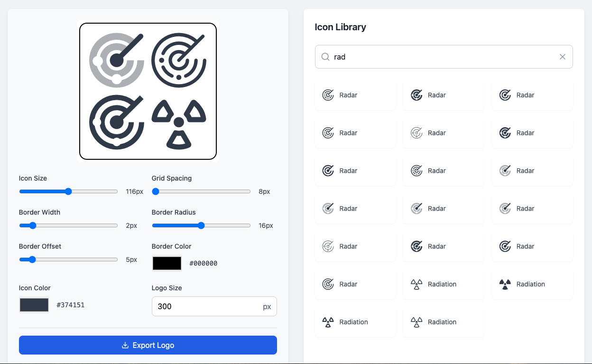

# "Februrary No Code Challenge"
This is part of my no-code-feb, where I try to build applications
of increasing complexity to find the outter limit of what AI can do
to replace my code-first inner developer.

- __When__: Week 3 Feb 2025
- __Timelimit__: 1hr, actual time 17m.
- __Tokens__: 210k
- __Ai Builder__: [Bolt.new](https://bolt.new)
- __Quality__: Good for Internal use. Not production ready.
- __Demo__: [Feb-No-Code-Challenge](https://apps.logo.lowcodecto.com/)

# Goal
The goal of this app is help me build and change the logo for
my newsletter every few weeks. Google has icon changes for the
seasons. If I could make the logo creation so easy, then I can
change it every few weeks.

- One page application.
- Built in React.js
- Uses an Algolia Index for Icon names.
- Builts a 2x2 grid using icons.
- Allows the user to search and brower all the icons in the library.
- Allows the user to change the icon width, spacing, color.
- Exports to a PNG file.
- Local storage for the icons defaults and settings.
- Uses Redux for state management.
- Uses Netlify for hosting.

## Pain Points
- Took longer to setup because I needed to tell the AI to use the canvas approach.
- The integration fo the Algolia library took 30% of the time as it requires a number of prompt revisions.
- The export reuqired code level prompt to get it include a CSS to PNG offset.

## Subscribe to learn more...
I am a fractional CTO, and recovering startup founder. I use
No-Code and Low-Code tools and patterns to built revenue generating
applications, without the need to code.

[Subscribe to my newsletter](https://lowCodeCTO.com)
